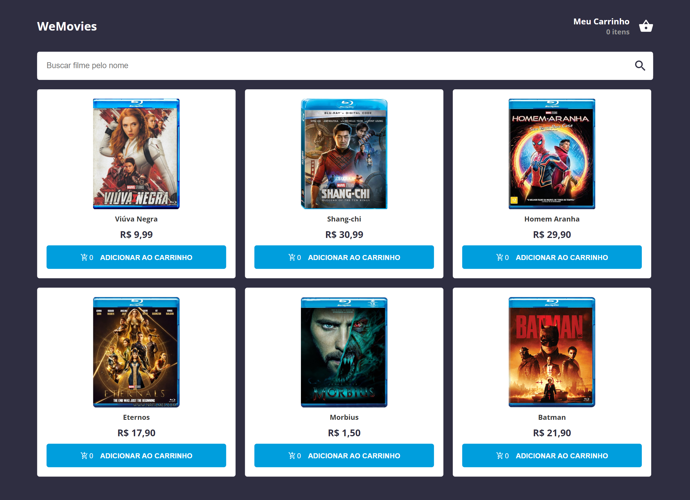
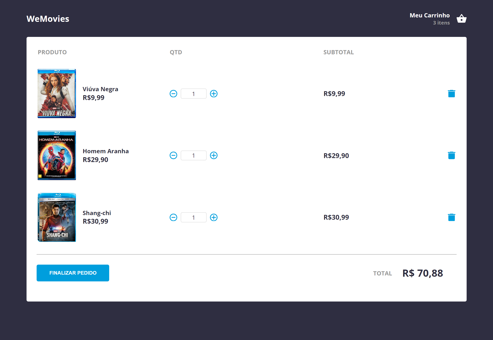
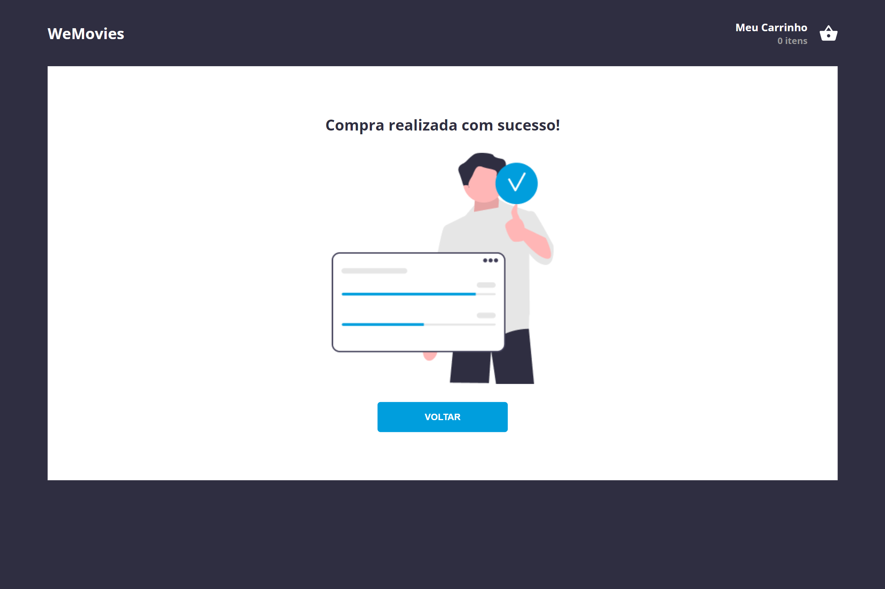

## We Movies React - Documentação

### Visão Geral do Projeto

**We Movies React** é uma aplicação de e-commerce simplificado focada na venda de filmes, desenvolvida como solução para um desafio técnico que envolve a utilização de React, TypeScript e styled-components. A aplicação é dividida em três módulos principais, proporcionando ao usuário uma experiência completa de navegação, seleção e compra de filmes:

**Home:** Apresenta uma lista de filmes que podem ser adicionados ao carrinho. Esta lista é obtida através de uma chamada a uma API simulada.

**Carrinho:** Permite ao usuário visualizar os itens selecionados, calcular o valor total da compra e remover itens indesejados. Exibe uma mensagem e oferece uma opção de retorno à tela inicial caso o carrinho esteja vazio.

**Compra Realizada:** Confirma a conclusão da compra e oferece ao usuário a opção de retornar à tela inicial para iniciar um novo processo de compra.

O design do projeto foi inspirado em um protótipo disponibilizado no Figma, visando a fidelidade ao layout proposto.

### Tecnologias e Ferramentas

A escolha das tecnologias foi guiada pela necessidade de criar uma aplicação moderna, escalável e de fácil manutenção. Abaixo, detalhamos as principais ferramentas utilizadas e justificativas para suas escolhas:

**React:** Utilizado para o desenvolvimento de interfaces de usuário dinâmicas e reativas, aproveitando o conceito de componentes reutilizáveis.

**TypeScript:** Adotado para adicionar tipagem estática ao código, melhorando a legibilidade, a manutenção e a detecção precoce de erros.

**Styled-components:** Escolhido para permitir a escrita de CSS no contexto do JavaScript, facilitando a estilização dos componentes de forma isolada e sem conflitos.

**Axios:** Utilizado para facilitar as requisições HTTP à API, graças à sua interface simples e baseada em Promises.

**React Query:** Implementado para gerenciar e otimizar as requisições de dados assíncronos, caching e atualizações de estado relacionadas à API.

**Zustand:** Escolhido pela sua simplicidade e eficácia no gerenciamento de estado global da aplicação, particularmente útil para o estado do carrinho de compras.

**React Router Dom:** Utilizado para gerenciar as rotas da aplicação, permitindo uma navegação fluida entre as diferentes telas.

**Vite:** Escolhido como ferramenta de build por oferecer um ambiente de desenvolvimento mais rápido e uma configuração simplificada em comparação a outras ferramentas.

Como Instalar e Executar o Projeto
Pré-Requisitos
Certifique-se de ter o Node.js e o npm instalados em sua máquina. Eles são necessários para executar o projeto.

```
Passos para Execução

Clone o Repositório:
git clone https://github.com/robsondeandrade/we-movies.git

Acesse o Diretório do Projeto:
cd we-movies-react

Instale as Dependências:
npm install

Inicie o Servidor da API Simulada:
O projeto simula uma API utilizando o json-server. Para iniciar o
servidor, execute:
npm run server
Isso disponibilizará a API simulada localmente, geralmente no endereço http://localhost:5000, contendo a lista de filmes.

Inicie a Aplicação:
Com o servidor da API em execução, abra um novo terminal no mesmo diretório e inicie a aplicação com:

npm run dev
A aplicação estará disponível em http://localhost:5173, permitindo que você acesse as funcionalidades do projeto.
```

## Telas do Projeto

### Tela Home



### Tela Carrinho



### Tela de Compra Realizada


